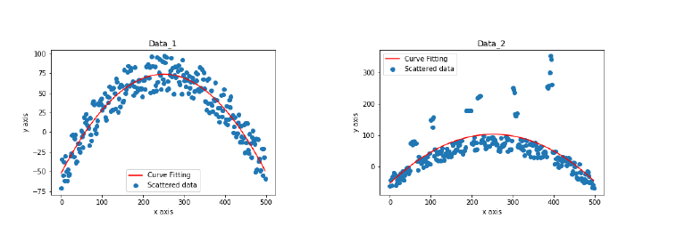
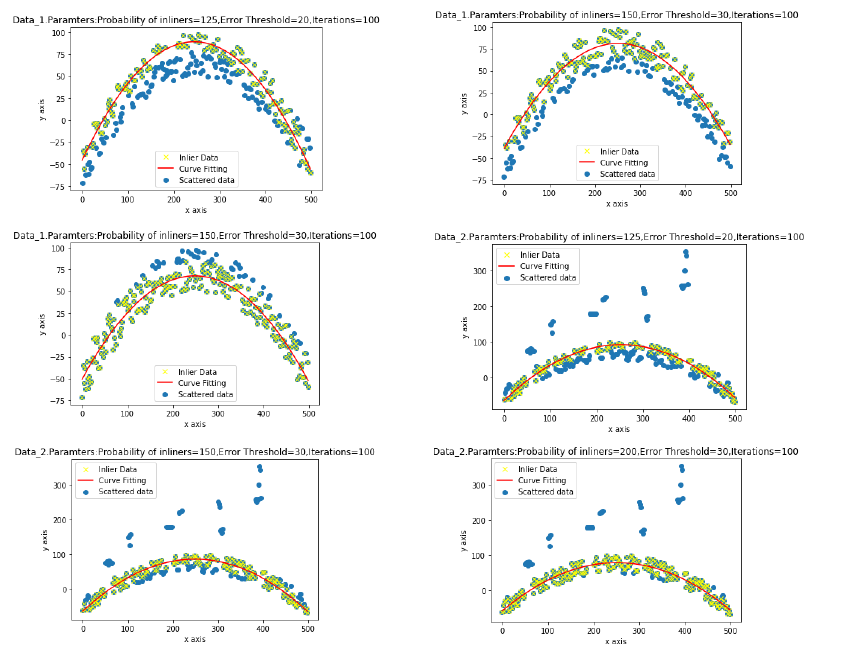

# Curve Fitting

In this project we implemented 4 algorithms for curve fitting,
- Ordinary Least Squares (OLS)
- Total Least Squares (TLS)
- Least Squares with Regularization (LSR) 
- RANSAC (Random Sample Consensus)

<p align="center">
  <p align="center"></p>
  <p align="center"></p>
</p>

## Authors

- [Praveen](https://github.com/Praveen1098)
- [Arjun Srinivasan](https://github.com/aarjunsrinivasan)
- [Arun Kumar](https://github.com/akdhandy)

## Dependencies

- Python 3.X
- Matplotlib
- NumPy

## Procedure to run the Codes:
Run the Python scripts in the current directory which contains all the code.
 - OLS, TLS and LSR
 
   ```
   python3 leastSquares.py 
   ```
 - RANSAC
 
   ```
   python3 RANSAC.py 
   ```
